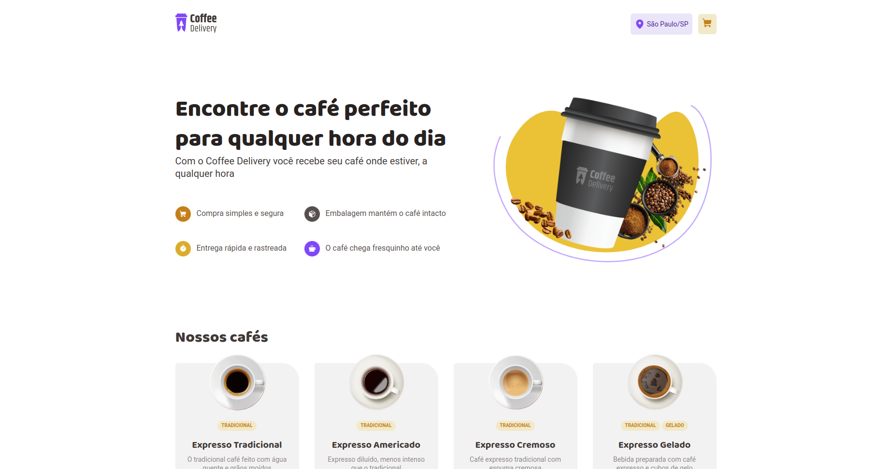

# Coffee Delivery

Esta solução é baseada no curso Rocketseat - Coffee Delivery Desafio prático. 

## Índice

- [Visão geral](#visão-geral)
   - [Captura de tela](#sobre-o-projeto)
   - [Link](#link)
- [Meu processo](#meu-processo)
   - [Construído com](#construído-com)
   - [O que aprendi](#o-que-aprendi)
- [Autor](#autor)

# Visão geral

Coffee Delivery - é um sistema prático de compras de café online. Os usuários podem explorar uma variedade de cafés, escolher a quantidade desejada e adicioná-los ao carrinho de compras. O sistema inclui uma funcionalidade de carrinho, onde os usuários podem inserir o endereço de entrega com busca automática por CEP via [ViaCEP]. Além disso, oferece opções de escolha de pagamento, a capacidade de ajustar a quantidade de cafés no carrinho e a remoção fácil de itens específicos. O valor total do pedido é exibido, e ao concluir a compra, os usuários são redirecionados para uma página com detalhes, incluindo o endereço de entrega e a forma de pagamento escolhidos.

### Captura de tela
  


## Link

- Solution URL: [GitHub](https://github.com/AIemao/coffeDelivery)

## Meu processo

### Construido com

- [ReactJS](https://react.dev/)
- [Typescript](https://www.typescriptlang.org/)
- [React Router DOM](https://reactrouter.com/en/main)
- [Styled Components](https://styled-components.com/)
- [Context API](https://legacy.reactjs.org/docs/context.html)
- [Reducer](https://react.dev/reference/react/useReducer)
- [Axios](https://axios-http.com/ptbr/docs/intro)
- [Phosphor Icons](https://phosphoricons.com/)
- [UUID](https://www.npmjs.com/package/uuid)
- [ImmerJS](https://immerjs.github.io/immer/)

### O que aprendi

Durante o desenvolvimento deste projeto, adquiri habilidades essenciais, incluindo:

- Utilização eficaz do Styled Components para estilizar componentes de forma modular e reutilizável.
- Implementação do ImmerJS em conjunto com o Reducer para facilitar a manipulação do estado de forma imutável, melhorando a previsibilidade e legibilidade do código.

````JS Styled Components
      export const GlobalStyle = createGlobalStyle`
        body {
          background: ${(props) => props.theme.white};
          color: ${(props) => props.theme['base-text']};
          -webkit-font-smoothing: antiliased;
        }
      `
````

````JS Recuder - Immer
      switch (action.type) {
        case ActionTypes.ADD_ADDRESS: {
          return produce(state, (draft) => {
            draft.address = action.payload.newAddress
          })
        }
      }
````

## Autor

- Site - [Celio Junior](https://www.linkedin.com/in/celio-junior-152529193/)
